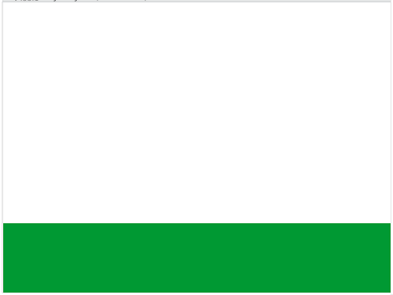

# Scratch - trollkarlen Ash

Hjälp trollkarlen Ash i kampen mot dom onda Moorgerna. Skapa egna trollformler och visa hur man undviker fiender. 
Vi lär oss mer om animation, gravitation, kloner och variabler.

Utveckling: https://scratch.mit.edu/users/Ratcher05/

Grafik: https://scratch.mit.edu/users/MaEk_Animations/

## Förberedelser
* Hitta igen följande project och spara ner alla sprites i din ryggsäck: https://scratch.mit.edu/projects/142913300/
* Skapa ett nytt projekt. 
* Rensa bort katten
* Skapa en bakgrund som är lik nedanstående. Det viktiga är att marken är i en färg och himlen en annan:

## Ash

### Lägg till Ash
* Flytta in Ash från ryggsäcken till ditt projekt
* Ställ Ash på marken (dra ner Ash tills hen står på marken och titta vilken y-koordinat som då anges i fönstret):

### Få Ash att gå vänster och höger
Vi gör så att Ash kan röra sig över skärmen.

Finns det andra sätt man kunde ha löst det på? Vad hade hänt om man gjort så här:

### Animera Ash
Vi gör så att figuren ser ut att gå över skärmen 

## Kasta besvärjelse
### Förberedelser
Flytta in den besvärlse du vill använda (hjärtat eller stjärnan) från ryggsäcken.

###Kasta besvärjelse version 1
När spelar trycker space så ska besvärlsen kastas mot muspekaren. Då besvärjelsen träffar kanten ska den försvinna
Se till att besvärjelsen alltid startar på samma plats som Ash och att den är gömd:

Problem: Det går bara att kasta en i taget!

###Kasta besvärjelse version 2
När spelar trycker space så ska en klon skapas av spriten.

Problem: När vi trycker på space flera ggr blir det för många besvärjelser.

###Kasta besvärjelse version 3
När vi trycker space, kolla om vi är en klon innan vi skapar en klon.

