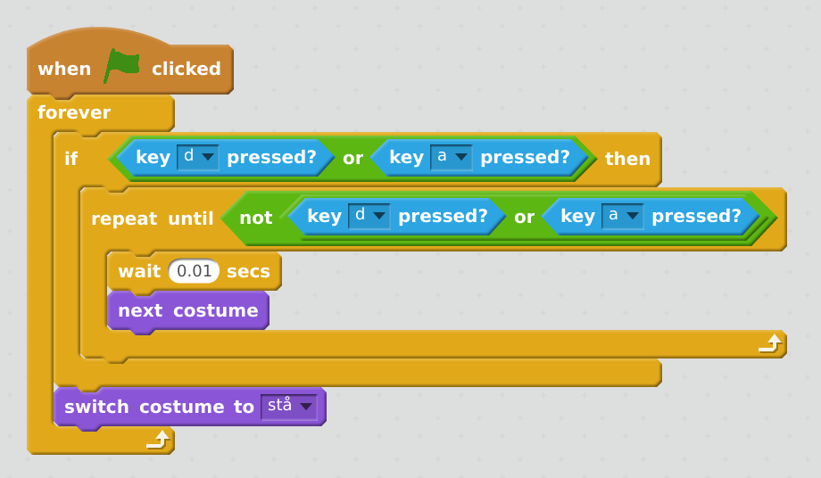

# Scratch - trollkarlen Ash

Hjälp trollkarlen Ash i kampen mot dom onda Moorgerna. Skapa egna trollformler och visa hur man undviker fiender. 
Vi lär oss mer om animation, gravitation, kloner och variabler.

Utveckling: https://scratch.mit.edu/users/Ratcher05/

Grafik: https://scratch.mit.edu/users/MaEk_Animations/

## Förberedelser
* Hitta igen följande project och spara ner alla sprites i din ryggsäck: https://scratch.mit.edu/projects/142913300/
* Skapa ett nytt projekt. 
* Rensa bort katten
* Skapa en bakgrund som är lik nedanstående. Det viktiga är att marken är i en färg och himlen en annan:

## Ash

### Lägg till Ash
* Flytta in Ash från ryggsäcken till ditt projekt
* Ställ Ash på marken (dra ner Ash tills hen står på marken och titta vilken y-koordinat som då står):

### Få Ash att gå vänster och höger
Vi gör så att Ash kan röra sig över skärmen.

Finns det andra sätt man kunde ha löst det på? Vad hade hänt om man gjort så här:

### Animera Ash
Vi gör så att figuren ser ut att gå hen rör sig över skärmen 

## Kasta besvärjelse

